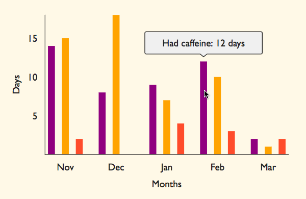

# DayTrace

An app for personal data tracking, analysis & visualization

## Summary

The idea behind DayTrace is that a user can aggregate data about their habits, health issues, and activities by customizing their own list of trackable actions and then simply checking them off each day. This data will be viewable in several formats as it accumulates - bar charts, line graphs, and calendar heatmaps. In this way a user will be able to see a visual representation of otherwise ephemeral aspects of their daily life. Additionally, a user will be able to compare the frequency of multiple activities against each other (for example, caffeine and alcohol intake against headache occurrence).

## Implementation

In it's current state, DayTrace is little more than a scaffolding consisting of an Express server, a Postgres database, several React components and a Redux store. My plan for building out my desired features includes:

* Using test-driven development with Mocha, Chai and Enzyme to implement features from back to front
* Creating customizable data visualizations for a user's data with Victory, Google Charts, or a similar library
* Making a clean, sensible and robust user interface
